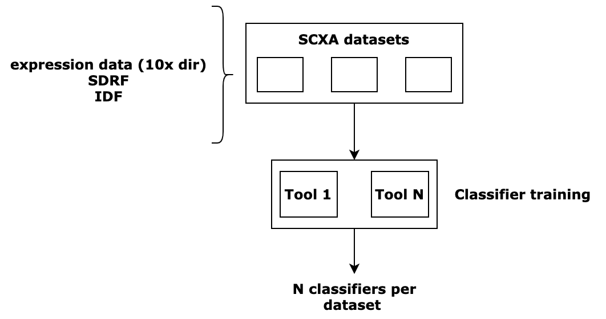

# cell-types-train-control-workflow
Schematic representation of the process is shown below: 


This is a workflow-of-workflows that sets up and triggers the execution of the following child workflows: 
* [scmap-train-workflow](https://github.com/ebi-gene-expression-group/scmap-train-workflow)
* [scpred-train-workflow](https://github.com/ebi-gene-expression-group/scpred-train-workflow/blob/develop/README.md)
* [garnett-train-workflow](https://github.com/ebi-gene-expression-group/garnett-train-workflow)

Each of these workflows generates classifiers based on all specified training datasets. 

This workflow scans a user-provided comma-separated text file for specified SCXA dataests, imports them and trains a range of classifiers for each dataset. The following columns are expected in the config file: 
* `dataset id` (from SCXA)
* `technology type` _("droplet" or "smart-seq")_
* `matrix type` _(raw, filtered, CPM- or TPM-normalised)_
* `number of clusters in marker gene file` 
* `barcode column` (in SDRF file) 
* `cell type column` 

Example config file can be found [here](example_config.txt).

### Setting up config
The control workflow's and individual methods' parameters can be set from `nextflow.config`. You can speficy the path to the training datasets file there (`data/datasets.txt` is used by default). See the comments in the config file for further information. 

### Running the workflow 
Prior to running the workflow, you will need to fetch and update the submodules for individual tool workflows. Run the following command from the workflow directory: 
```
./bin/fetch_tool_training_workflows.sh 
```

You will need to have [conda](https://docs.conda.io/en/latest/) installed to run the workflow. It is recommended to use a clean environment to avoid dependency conflicts. Issue the following commands: 
```
conda create -n nextflow && conda activate nextflow 
conda install nextflow 
./bin/run_control_workflow.sh <profile>
```
In the `run_control_workflow.sh` script, the `<profile>` parameter might be either `standard` or `cluster` depending on where you run the process. More information provided [here](https://www.nextflow.io/docs/latest/executor.html#).

### Outputs 
Workflow outputs can be found in `data/<DATASET_ID>` directory.

